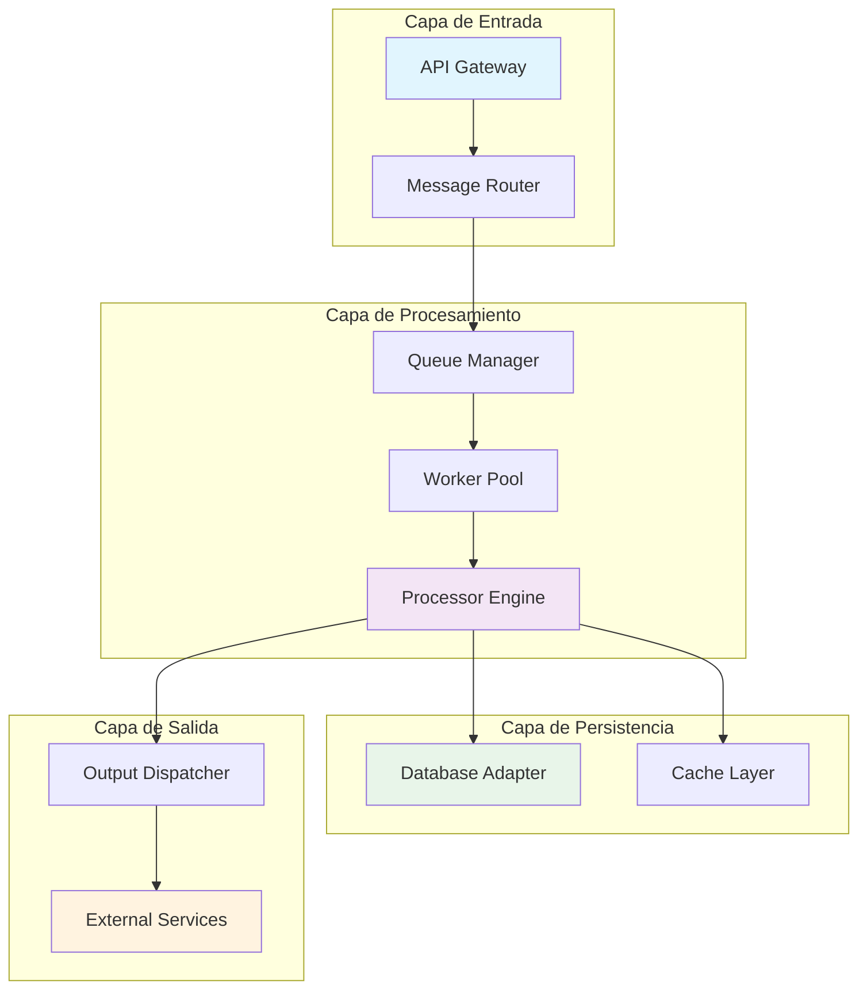
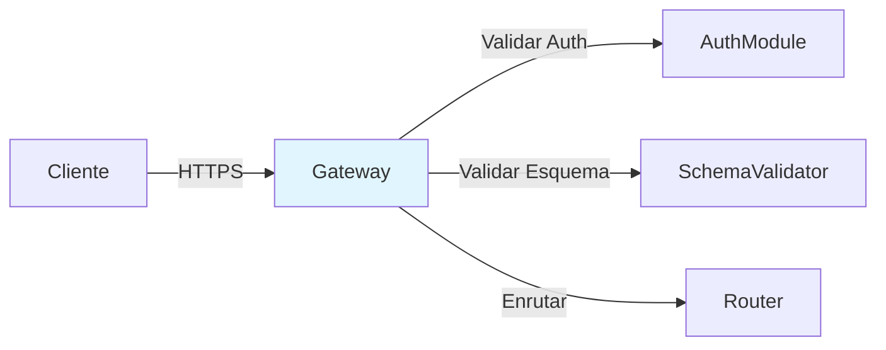
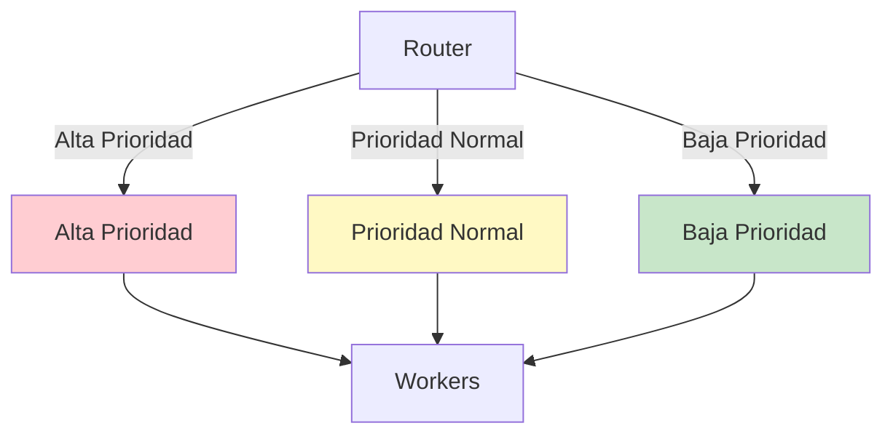
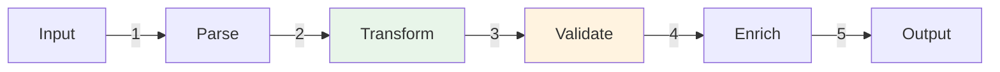
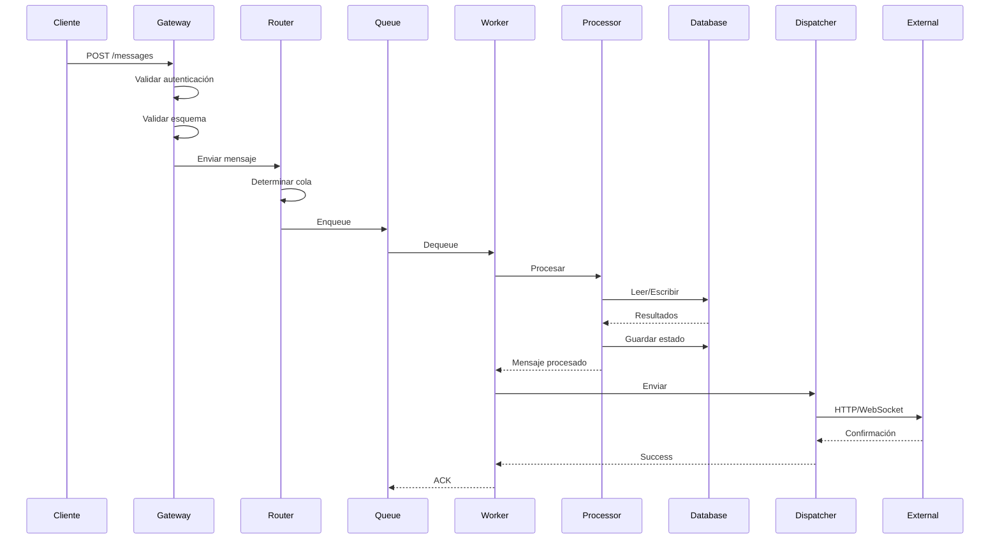
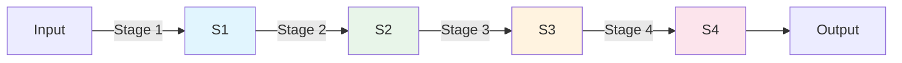
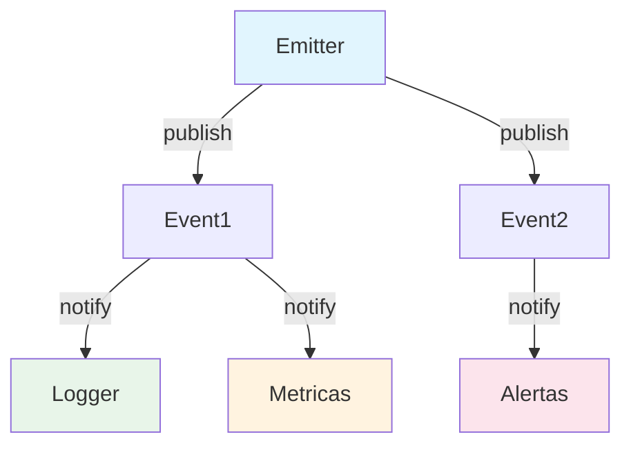
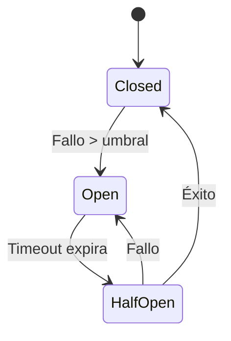

# Arquitectura de Hermes Agent

Este documento describe la arquitectura general de Hermes Agent, sus componentes principales, el flujo de datos y los patrones de diseño utilizados.

## Arquitectura General

Hermes Agent es un sistema modular diseñado para procesar y enrutar mensajes de manera eficiente. La arquitectura sigue un enfoque de microservicios con comunicación asíncrona, permitiendo alta escalabilidad y tolerancia a fallos.

### Vista General del Sistema

## Componentes Principales

### 1. API Gateway

El **API Gateway** actúa como punto de entrada único para todas las solicitudes externas. Sus responsabilidades incluyen:

- **Autenticación y autorización** de clientes
- **Validación de esquemas** de entrada
- **Rate limiting** y throttling
- **Enrutamiento** de solicitudes a componentes internos

### 2. Message Router

El **Message Router** determina el destino apropiado para cada mensaje basándose en:

- **Metadatos del mensaje** (tipo, prioridad, etiquetas)
- **Reglas de negocio** configuradas
- **Estado del sistema** (carga, disponibilidad)

### 3. Queue Manager

El **Queue Manager** gestiona colas de prioridad para controlar el flujo de mensajes:

- **Múltiples colas** por tipo de mensaje
- **Priorización dinámica** basada en configuración
- **Backpressure** para evitar sobrecarga
- **Persistencia** de mensajes pendientes

### 4. Worker Pool

El **Worker Pool** es un conjunto de workers que procesan mensajes en paralelo:

- **Workers dinámicos** que escalan según la carga
- **Graceful shutdown** para finalizar trabajos en curso
- **Health checks** periódicos
- **Reinicialización automática** en caso de fallos

### 5. Processor Engine

El **Processor Engine** contiene la lógica de procesamiento de mensajes:

- **Pipeline de transformación** modular
- **Plugins configurables** para cada etapa
- **Validación de salida** antes de enviar
- **Logging y métricas** integrados

### 6. Database Adapter

El **Database Adapter** proporciona una capa de abstracción sobre sistemas de almacenamiento:

- **Soporte multi-base** de datos (PostgreSQL, MongoDB, etc.)
- **Connection pooling** eficiente
- **Transacciones** con reintentos automáticos
- **Migrations** versionadas

### 7. Cache Layer

El **Cache Layer** mejora el rendimiento mediante:

- **Caching en memoria** (Redis, Memcached)
- **TTL configurables** por tipo de dato
- **Invalidación inteligente** basada en eventos
- **Distributed caching** para escalado horizontal

### 8. Output Dispatcher

El **Output Dispatcher** envía mensajes procesados a destinos externos:

- **Retry con backoff exponencial**
- **Dead letter queue** para mensajes fallidos
- **Circuit breakers** para servicios externos
- **Batching** optimizado

## Flujo de Datos

### Ciclo de Vida de un Mensaje

### Detalle del Flujo

1. **Recepción** (`Gateway`): El cliente envía un mensaje a través de la API
2. **Validación** (`Gateway`): Se verifica autenticación y esquema del mensaje
3. **Enrutamiento** (`Router`): Se determina la cola de destino basándose en reglas
4. **Encolado** (`Queue Manager`): El mensaje se almacena en la cola apropiada
5. **Asignación** (`Worker Pool`): Un worker disponible toma el mensaje
6. **Procesamiento** (`Processor Engine`): Se ejecuta el pipeline de transformación
7. **Persistencia** (`Database Adapter`): Se guarda el estado y resultados
8. **Caching** (`Cache Layer`): Se almacenan datos en caché si es aplicable
9. **Envío** (`Output Dispatcher`): El mensaje se envía al destino externo
10. **Confirmación**: Se marca el mensaje como completado

## Patrones de Diseño Utilizados

### 1. Producer-Consumer

El sistema implementa el patrón **Producer-Consumer** para desacoplamiento:

- **Producers**: Gateway y Router generan mensajes
- **Consumers**: Workers consumen y procesan mensajes
- **Buffer**: Colas actúan como buffer asíncrono

**Ventajas:**
- Desacoplamiento temporal
- Balanceo de carga
- Tolerancia a fallos

### 2. Pipeline

El **Processor Engine** utiliza el patrón **Pipeline** para transformaciones:

**Implementación:**
- Cada etapa es un componente independiente
- Datos fluyen secuencialmente a través de etapas
- Fácil añadir o remover etapas

### 3. Strategy

El **Message Router** usa el patrón **Strategy** para enrutamiento dinámico:

- Diferentes estrategias de enrutamiento intercambiables
- Configuración en tiempo de ejecución
- Testing facilitado

### 4. Observer

El sistema implementa **Observer** para eventos y métricas:

- Componentes publican eventos de estado
- Subscribers reaccionan a eventos relevantes
- Logging, métricas y notificaciones

### 5. Circuit Breaker

El **Output Dispatcher** utiliza **Circuit Breaker** para servicios externos:

- **Closed**: Operación normal
- **Open**: Fallos detectados, bloquea llamadas
- **Half-Open**: Prueba recuperación gradual

**Estados:**

### 6. Factory

El **Worker Pool** usa **Factory** para crear workers:

- Creación dinámica de instancias
- Configuración flexible
- Testing con mocks

### 7. Singleton

Varios componentes usan **Singleton** para recursos compartidos:

- Database Adapter (connection pool)
- Cache Layer (cliente Redis)
- Configuration Manager

### 8. Repository

El **Database Adapter** implementa **Repository**:

- Abstracción sobre queries
- Lógica de negocio de acceso a datos
- Facilidad para mocking en tests

## Escalabilidad y Tolerancia a Fallos

### Escalabilidad Horizontal

- **Workers**: Añadir más workers para mayor throughput
- **Colas**: Particionar colas por tipo o región
- **Database**: Replicación y sharding
- **Cache**: Clustering de Redis

### Tolerancia a Fallos

- **Workers**: Reinicio automático en fallos
- **Queue**: Persistencia ante caídas
- **Services**: Circuit breakers y retries
- **Database**: Replicación y backups

## Métricas y Monitoring

### Métricas Clave

- **Throughput**: Mensajes por segundo
- **Latencia**: Tiempo de end-to-end
- **Queue Length**: Mensajes pendientes
- **Error Rate**: Tasa de fallos
- **Worker Utilization**: Uso de recursos

### Endpoints de Monitoring

- `/metrics` - Métricas en formato Prometheus
- `/health` - Health check del sistema
- `/status` - Estado detallado de componentes

## Consideraciones de Seguridad

- **Authentication**: JWT tokens con TTL
- **Authorization**: RBAC (Role-Based Access Control)
- **Encryption**: TLS en todas las comunicaciones
- **Input Validation**: Validación estricta de esquemas
- **Rate Limiting**: Protección contra DoS
- **Audit Logging**: Log de acciones sensibles

## Próximos Pasos

Para profundizar en el desarrollo con Hermes Agent:

1. Consulta la [guía de extensión](./extender.md) para crear plugins
2. Revisa los [ejemplos de uso](../ejemplos/) en la documentación
3. Explora la [API reference](../api/) para detalles de integración